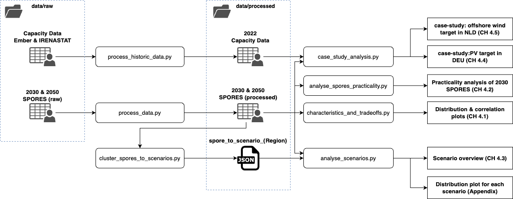

This project is a MSc thesis project of Giel van der Weerd to obtain a MSc degree in Sustainable Energy Technology at Delft University of Technology.

Data obtained from:
-
2050 spores data downloaded from:\
https://zenodo.org/record/6546817

geographical units "eurospores_units.geojson" obtained from:\
https://zenodo.org/record/6655601

historic capacity data obtained from:\
https://pxweb.irena.org/pxweb/en/IRENASTAT \
https://ember-climate.org/data/data-tools/data-explorer/ 

Repository file structure:
-

